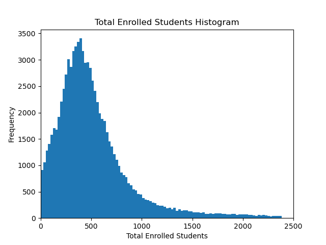

# US-School-Analysis

In this project, I analyzed public school data to search for correlations and insights, primarily about Student-Teacher Ratios (STR) in the US.

The process began with loading, cleaning, and reorganizing the data. I used histograms to find and remove outliers.

## Histogram Before

## Histogram After Removing Outliers

I then plotted a correlation heatmap with Seaborn to find which features were most correlated.

## Correlation Heatmap

Next, I plotted a geographic plot of all schools in the dataset to verify coverage. Utah and Illinois were notably missing; I had to drop that data due to nulls.

## Geographic Plot of Schools in CONUS

Finally, I plotted a bar chart showing student-teacher ratios by state, in descending order.

## Student-Teacher Ratios by State

### Observations after analyzing the data:

- The largest correlation is that of total teachers and total students. It makes sense that the more students a school has, the more teachers it requires. Total students and teachers also correlate with higher student populations of Asian, Black, Hawaiian, Two or more Races, and White students. Finally, White students are correlated with Two or more Race students.

- My state of Texas' Student-Teacher Ratio is almost exactly at the mean STR of all states.

- I would have renamed the columns to be more human-readable.

- IL schools have all nulls in the Total Teachers column, and "-1" in the Student-Teacher Ratios. Unfortunately, they all had to be dropped. The same is true for Utah except for one school.

- Some interesting observations I found: The 5 states with the lowest STR are all Northern states. California is the extreme outlier in high STR.

- Further analysis could include using the Latitude and Longitude columns to map schools to the nearest major cities with N population, and compare Total Students, Total Teachers, and STR by distance to the major city.
